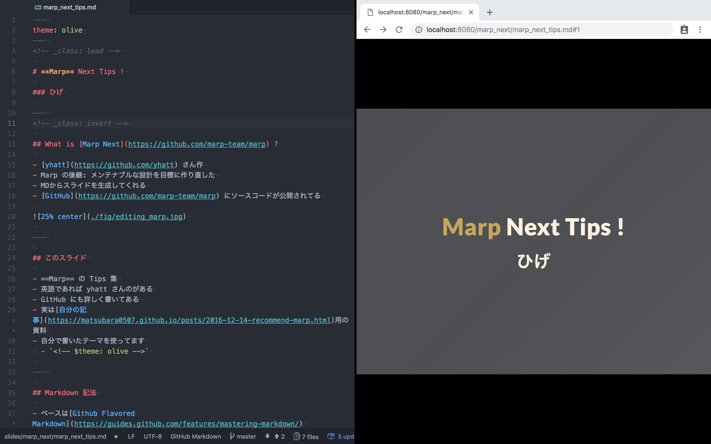

<!-- _class: lead -->

# **Marp** Next Tips !

### ひげ

---

## What is [Marp Next](https://github.com/marp-team/marp) ?

- [yhatt](https://github.com/yhatt) さん作
- Marp の後継: メンテナブルな設計を目標に作り直した
- MDからスライドを生成してくれる
- [GitHub](https://github.com/marp-team/marp) にソースコードが公開されてる

# 

---

## What is [Marp Next](https://github.com/marp-team/marp) ?

- 旧 Marp は Electron 製のデスクトップだった
- Marp Next は:
    - [CLI ツール](https://github.com/marp-team/marp-cli)
    - [Web UI](https://github.com/marp-team/marp-web) (α版みたいなのならある)
    - Desktop (まだできてない)

なので以降では CLI ツールを使っている想定:

```
$ npx @marp-team/marp-cli --theme-set path/to/my/themes -s -- .
```

CLI ツールの [Docker イメージもある](https://hub.docker.com/r/marpteam/marp-cli/)
(ただし機能が制限される)

---

## このスライド

- **Marp Next** の Tips 集
    - 注意: Marp Next はまだ完成してないみたい
    - 数ヶ月後には変わってるかも
- 自分の記事用のスライド
- 自分で書いたテーマを使ってます
    - `<!-- $theme: olive -->`

---

## Markdown 記法

- ベースは[Common Markdown](https://spec.commonmark.org/0.28/#example-28)
    - ２段階の拡張がされている ([Marpit](https://marpit.marp.app) と [Marp Core](https://github.com/marp-team/marp-core))
- `---` でスライドを区切る
    - [Deckest](http://www.decksetapp.com/) に寄せてるらしい

```markdown
## What is [Marp Next](https://github.com/marp-team/marp) ?

- [yhatt](https://github.com/yhatt) さん作
- Marp の後継: メンテナブルな設計を目標に作り直した
- MDからスライドを生成してくれる
- [GitHub](https://github.com/marp-team/marp) にソースコードが公開されてる

# 

---

## このスライド
```

---

## テーマの変更

マークダウンの頭に `<!-- $theme: aaa -->` ないしは次のように Front-matter を使う:

```markdown
---
theme: olive
---
# **Marp** Next Tips !

### ひげ

---
```

元からあるのは `default` と `gaia` と `uncover` の3つ

---

## クラスの変更

Marp のテーマの「クラス」を切り替えることで
部分的にCSSを変更できる (e.g. カラースキーマを変えたり)

変更したいスライドの頭に `<!-- _class: aaa -->` と書くだけ:

```markdown
<!-- _class: invert -->

## What is [Marp Next](https://github.com/marp-team/marp) ?

- [yhatt](https://github.com/yhatt) さん作
- Marp の後継: メンテナブルな設計を目標に作り直した
```

`_` を外すと以降すべてのスライドに反映される

例えば `gaia` には `default`,`invert`,`gaia`,`lead` の4種類ある

---

## PDF へのエクスポートと

CLI ツールでオプションをつけるだけ:

```
$ npx @marp-team/marp-cli --theme-set path/to/my/themes --pdf -- slide.md
```

ただし:
- **[セキュリティの関係](https://github.com/marp-team/marp-cli/pull/10)でデフォルトではローカルファイルの画像などを埋め込めない**
    - ローカル画像を使うには `--allow-local-files` をつける
- 日本語フォントも変になっている気がする
    - 日本語検索もダメっぽい

なのでブラウザの印刷でPDFに書き出した方が良いかも

---

## プレゼンテーションモード

ブラウザの全画面でプレゼンモードっぽいこともできる:

```
$ npx @marp-team/marp-cli --theme-set path/to/my/themes --preview -- slide.md
```

---

## 画像に関するオプション

- `` で拡縮変更
- `` で背景に設定
- `` 空白区切りで複数指定

[他にも透過や背景の分割など色々できる](https://marpit.marp.app/image-syntax)

ただし *現状では中央寄せができない*

このスライドでは、テーマをいじって中央寄せをデフォルトにしてる

---

## 数式

- `$ ... $` や `$$ ... $$` で Latex の数式をレンダリング
- [KaTeX](https://khan.github.io/KaTeX/) を使ってる
    - Marp Next は 0.10.0 の最新版を使ってる模様
- なので完全に LaTeX 表記をサポートしていない
  - [可能な表記](https://katex.org/docs/supported.html)


$$ e ^ {i \pi} = -1 $$


```text
$$ e ^ {i \pi} = -1 $$
```

---
<!-- _header: this is headr -->
<!-- _footer: this is footer -->
<!-- _paginate: true -->

### その他

- Emoji をサポート :muscle:
    - [Twitter Emoji](https://twitter.github.io/twemoji/) を使ってる :baby_chick:
- `<!-- footer: this is footer -->` でフッターを設定
- `<!-- header: this is headr -->` でヘッダーを設定
- `<!-- paginate: true -->` でページ番号を追加
	- デフォルトは `false`
- [他にも背景色や文字色を一時的に変えるものもある](https://marpit.marp.app/directives?id=local-directives-1)

---

## 現状できないこと

- `==AAA==` のハイライトと打ち消し線ができなくなった :cry:
- クラスの重ねがけ
    - `lead` + `gaia` とかしたくなる

ぐらい？

---

<!-- _class : lead -->

# **おしまい**
